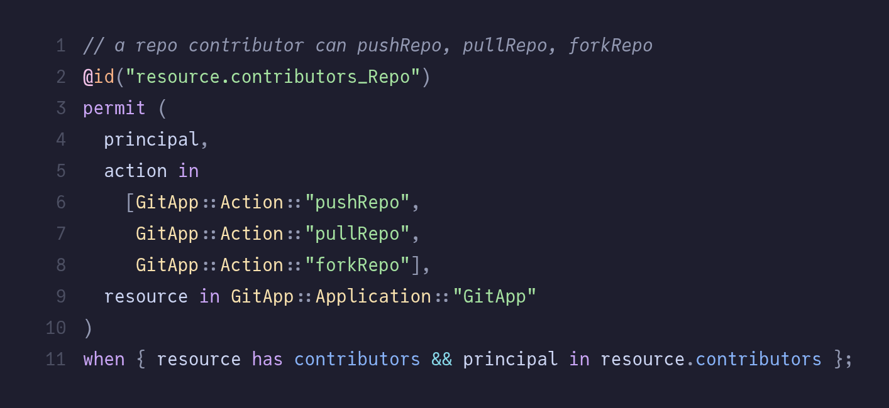
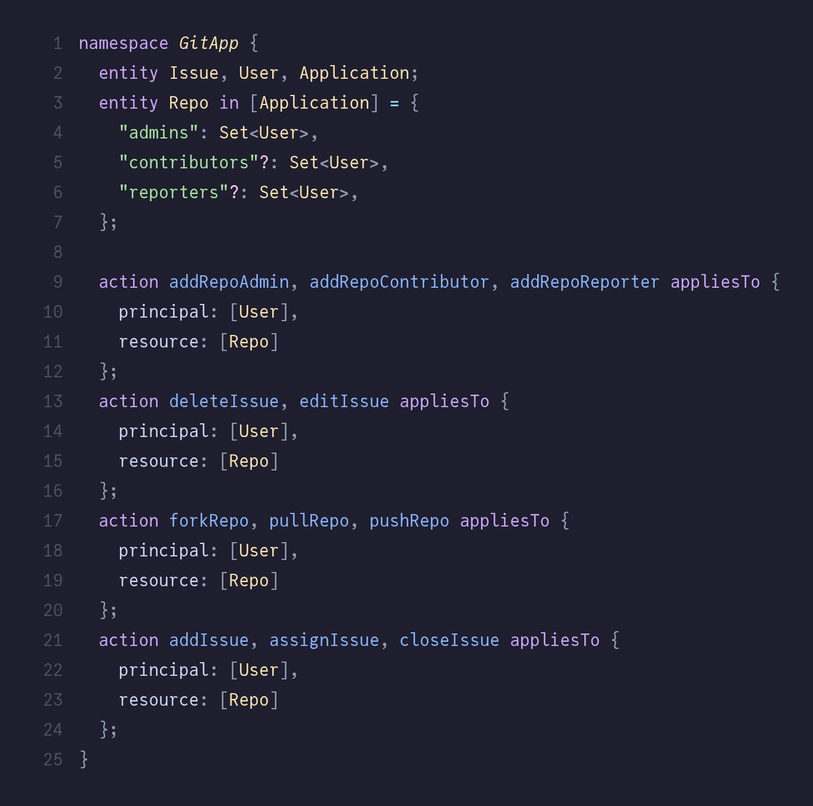
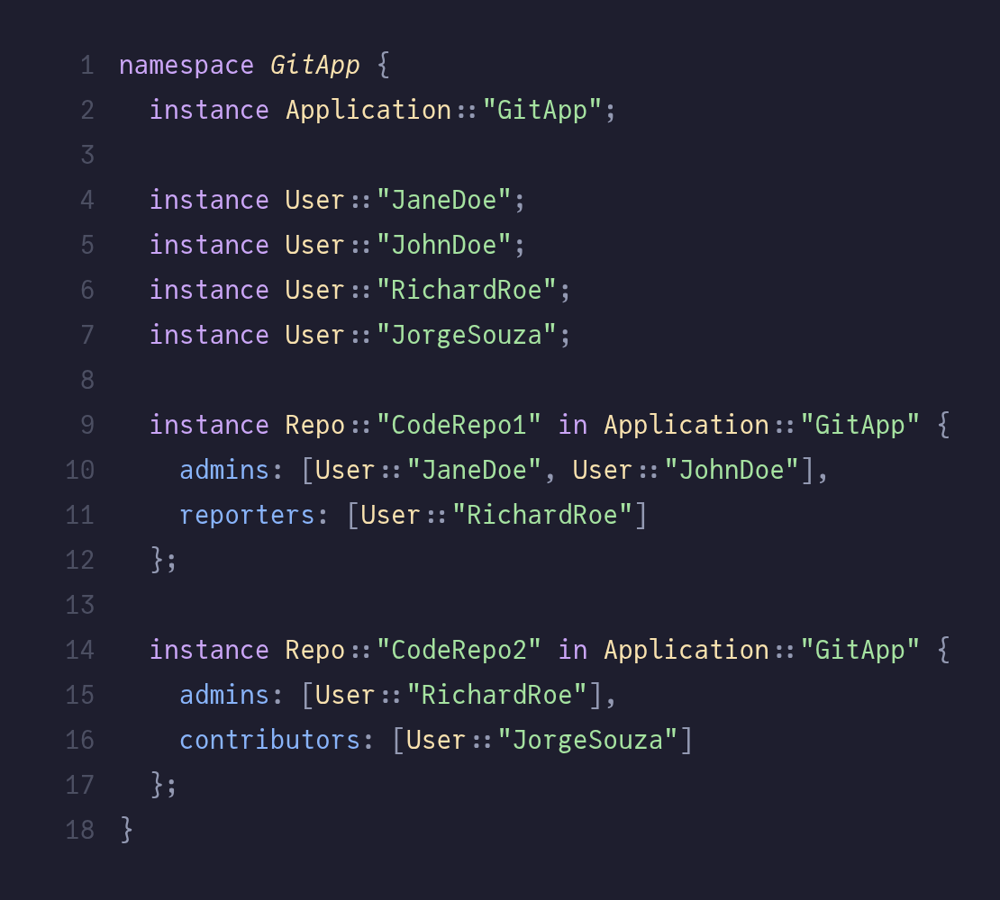

# `tree-sitter-cedar`

Cedar grammars for tree-sitter.

## Cedar

## Cedar Schema

## Cedar Entities

## License

`tree-sitter-cedar` is licensed under the terms of both the [MIT License](LICENSE-MIT) and the [Apache License (Version 2.0)](LICENSE-APACHE).
